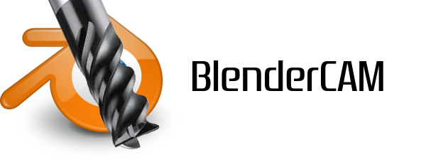
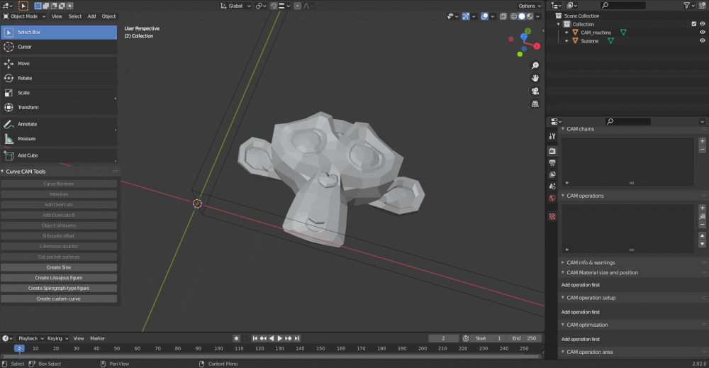

<center> 



- - - 


### An open source solution for artistic CAM with Blender 3D


[](https://riot.im/app/#/room/#blendercam:matrix.org) 
[](http://webchat.freenode.net/?channels=%23blendercam)
[](https://github.com/vilemduha/blendercam)


<br>

[About](#About) • [How to use](#-how-to-use-wiki) • [Features](#-features) • [Post-Processors](#-post-processors) • [Files](#-files-organisation) • [Contributing](#-contributing) • [License](#-disclaimer) 

<br>




</center>

## 👁️ About
Blender CAM is an open source solution for artistic CAM - Computer aided machining - a g-code generation tool.

Blender CAM is an add-on for the free open-source [Blender 3d package](https://www.blender.org/).

It has been used for many milling projects, and is actively developed. If you are a developer who would like to help, don't hesistate to fork the project and start generating pull requests.

## 👨‍🎓 How to use (Wiki)


BlenderCam is recommended with Linux. BlenderCam can work on Windows but the installation of a dependency (OpenCamlib) is tricky.

* [BlenderCam Installation](documentation/Blendercam%20Installation.md) 
* [Getting started](documentation/Getting%20started.md)
* [Panel descriptions](documentation/Blendercam-Panel-Descriptions.md)
* [Tools](documentation/Blendercam-Tools.md)
* [Example of using Profile and Pocket operations](documentation/Profile%20and%20Pocket%20operations.md)


## 👌 Features

|                            | Blender 2.92 and 2.80  
| -------------------------- | :----------------: |
| Several milling strategies for 2D and 3D          |         ✔️        | 
| Cutter types: ball, flat, v-carve with various angles, user definable             |         ✔️         |  
| work with 3d data or depth images       |         ✔️         |  
| Layers and skin for roughing. |         ✔️         |  
| Inverse milling   |         ✔️         |  
| Various options for ambient around model  |         ✔️         |  
| protection of vertical surfaces       |         ✔️         |  
| Stay low - option for movement       |         ✔️         |  
| Material size setup  |         ✔️         |  
| Simulation of 3d operations        |         ✔️         |  
| Helix entry, arc retract, ramp down for some of the strategies.   |         ✔️         |  
| Automatic bridges for cutout operation   |         ✔️         |  
| Chain export and simulation  |         ✔️         |  
| Background computing of the operations, so you can continue working   |         ✔️         |  

### Pending features
* Motion direction - classic, conventional, meander, are only partially supported

* 4 and 5 axis milling


## 💻 Post-processors
* GRBL
* Iso
* LinuxCNC - EMC2
* Fadal 
* Heidenhain
* Sieg KX1
* Hafco HM-50
* Centroïd M40
* Anilam Crusader M
* Gravos
* WinPC-NC
* ShopBot MTC
* Lynx Otter o
* ...


## 📒 Files organisation

```
.
├── config                     
├── scripts
│   ├── addons
│   │   ├── cam
│   │   │   ├── nc
│   │   │   └── opencamlib
│   │   ├── GPack
│   │   └── print_3d
│   │       ├── ini
│   │       └── machine_profiles
│   └── presets
│       ├── cam_cutters
│       ├── cam_machines
│       └── cam_operations
└── static

```


## 🤝 Contributing
BlenderCAM has been used for many milling projects, and is actively developed.

If you are a developer who would like to help, fork and open pull requests


## 🤕 DISCLAIMER

THE AUTHORS OF THIS SOFTWARE ACCEPT ABSOLUTELY NO LIABILITY FOR
ANY HARM OR LOSS RESULTING FROM ITS USE.  IT IS _EXTREMELY_ UNWISE
TO RELY ON SOFTWARE ALONE FOR SAFETY.  Any machinery capable of
harming persons must have provisions for completely removing power
from all motors, etc, before persons enter any danger area.  All
machinery must be designed to comply with local and national safety
codes, and the authors of this software can not, and do not, take
any responsibility for such compliance.

This software is released under the GPLv2.


