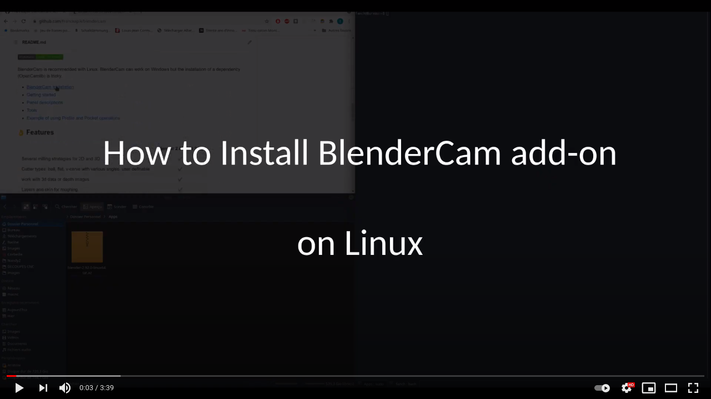
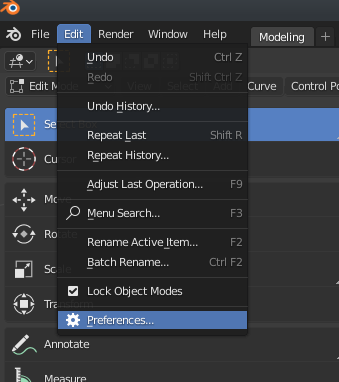
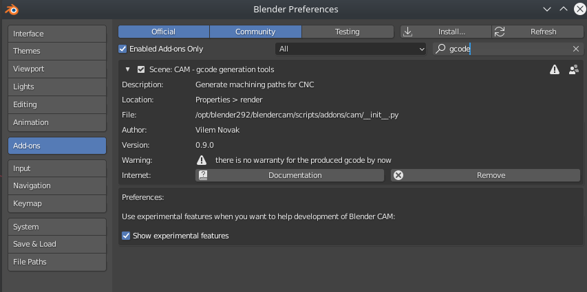

# How to install Blendercam ?

## Use Blendercam from github 

Using Blendercam from github is a great way to try out the newest features and fixes.  The latest build (dailybuild) of Blender can be used with the latest Master branch of Blendercam and then you can live on the bleeding edge.

The easiest way to "install" is not to install but instead just tell Blender where to find the add-on.  This way you don't have to worry about copying/moving files around.  You can keep Blendercam source files separate from Blender if using source control (ie git for development) and still easily test your changes in Blender.

If you are using Arch Linux, you can just install `blendercam-git` from the AUR and skip to [Enable Blendercam add-on](#enable-blendercam-add-on). OpenCAMLib is also available as `opencamlib-git`.

---

You can watch the video using the documentation below.

---

* [1. Obtaining Blender](#obtaining-blender)
* [2. Get Blendercam source code](#get-blendercam-source-code)
* [3. Setup Blender scripts alternate path](#setup-blender-scripts-alternate-file-path)
* [4. Enable Blendercam and required add-ons](#enable-blendercam-add-on)
* [5. (Optional) Install OpenCAMLib](#optional-install-opencamlib)
* [6. Updating Blendercam](#updating-blendercam)

## Obtaining Blender
Blendercam is an addon of Blender. It works now with Blender version 2.83, 2.92, 2.93, 3.0 - 3.4.

You can download blender from here:
https://www.blender.org/download/

## Dependencies

Blendercam depends on the following python modules. If they are not available in the python that your blender uses, the addon will auto-install
these modules on first load.

| Python dependencies        | Version           |
| ------------- |:-------------:|
| shapely  | >= 1.5 |
| numpy    | ...      |
| Equation | ...      |
| libgeos_c | libgeos-c1v5|
| opencamlib | >= 2022.12 |

## Get Blendercam addon
The first step is to get the addon from the github repository. You can either do this with git, or by downloading and extracting a zip file. 

### Install (and update) using Git
 1. If you have git installed on your machine, go to the root of this repository, and click the green 'Code' button and copy the https url.
 2. Open a command shell and change directory to where you want to install blendercam
 3. Type `git clone <GIT URL>`, where `<GIT URL>` is the url you copied above.
 4. git will make a subdirectory called `blendercam` in the current directory then download the most recent version of blendercam from github.
 5. If in future you want to update to the latest version, in a command shell change directory to the blendercam directory and type `git pull`.

 

### Install using zip file

 1. To install from a zip file, go to the root of this repository, and click the green 'Code' button and click 'download zip'. Extract that to wherever you want blendercam to be installed.
 2. To update, you need to repeat step 1 from scratch and overwrite the current folder.

## Setup Blender scripts alternate file path
The second step is to tell blender to also search an alternate path for add-ons.  When blender starts up it will search its own paths for add-ons and will also search the alternate path that you add.  This way an external source add-on can be used in Blender.

 1. select **User Preferences** panel

 

 2. select **File** tab
 3. select the file button on the **Scripts** input field and select the path to your *blendercam/scripts* directory

 

 4. select **Save User Settings**
 5. restart Blender

## Enable Blendercam and required add-ons
The next step is to enable the Blendercam add-on.

 1. select **User Preference** panel
 2. select **Add-ons** tab
 3. select **Scene** category
 4. enable the CAM addon by left clicking on the check box. (Note: the checkbox is on the left side in daily builds of Blender after 11 Jan 2016)  
   4a. the file path should match your Blendercam git path
 5. Optional: enable the experimental features
 6. enable additional bundled add-ons required by some Blendercam features:
    - Add Curve: Extra Objects
 7. select **Save User Settings**

Now when ever blender is started, the external blendercam add-on will be enabled.

## Opencamlib

[OpenCAMLib](https://github.com/aewallin/opencamlib) is an open source CAM library created by Anders Wallin. It offers high quality waterline generation and drop cutter sampling algorithms. For drop cutter algorithms it's more reliable than Bullet Physics (Blender's built-in collision detection library) and offers better performance (up to 30 times faster than regular algorithm on 24-core machine).

OpenCAMLib is automatically installed when you install blendercam.

To use OpenCAMLib waterlines, select "Show experimental features" in Blender User Preferences / Addons / CAM - gcode generation tools. Then select Waterline strategy and "Use OpenCAMLib". The current version lacks dialog for waterline resolution and automatic determination of cutter length, those can be adjusted in `scripts/addons/cam/opencamlib/opencamlib.py`.

For "parallel" strategy and other drop cutter sampling operations select both "Use exact mode" and "Use OpenCAMLib".
