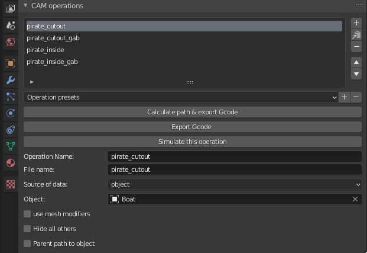
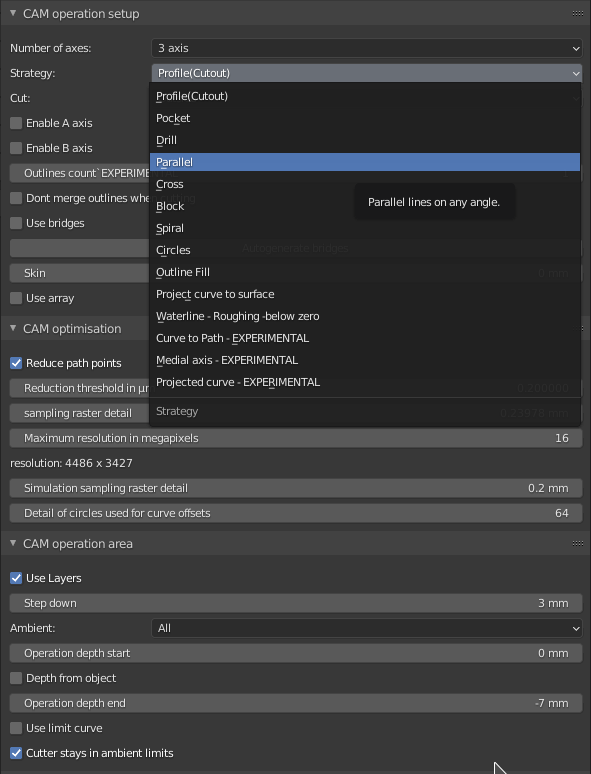
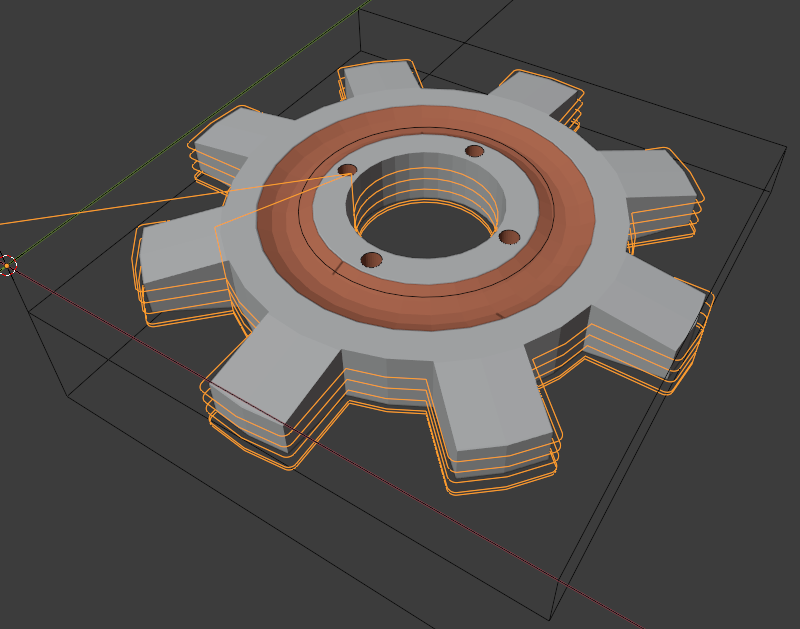
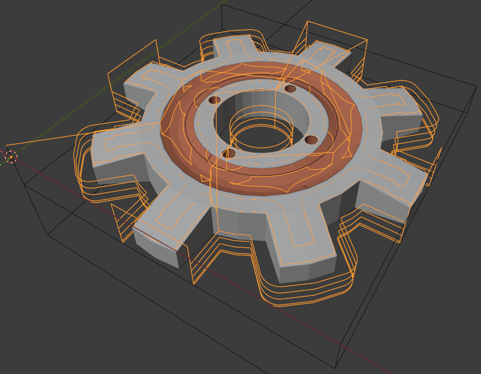
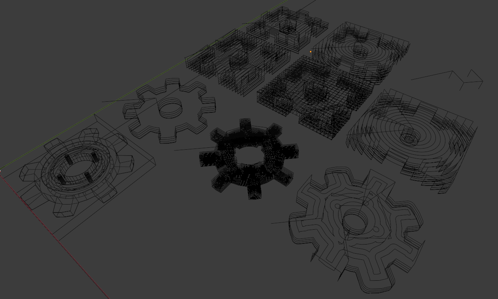
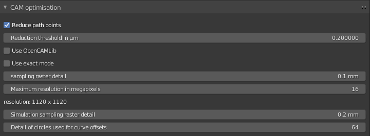
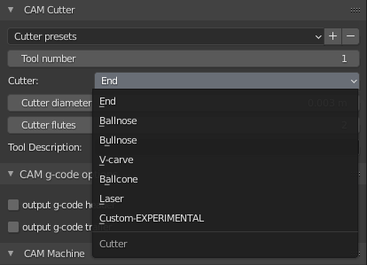
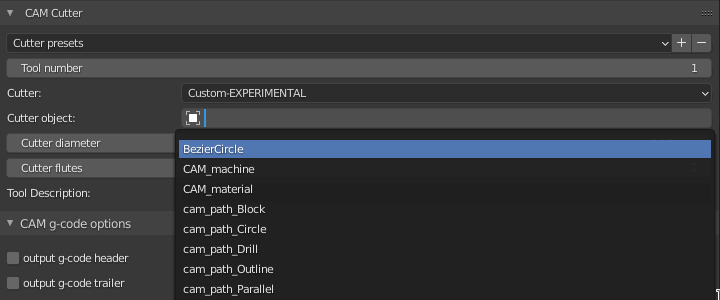
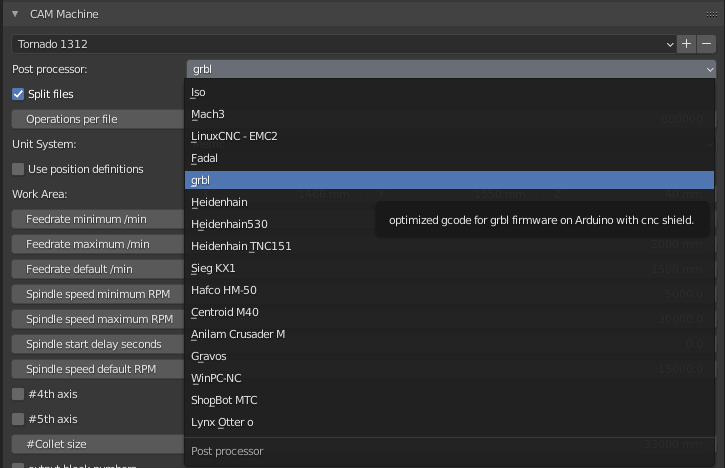

# Blendercam Panel Descriptions

* [Enter CAM mode](#enter-cam-mode)
* [CAM operations](#cam-operations-panel)
* [CAM info and Warnings](#cam-info-and-warnings-panel)
* [CAM operation setup](#cam-operation-setup-panel)
* [CAM optimization](#cam-optimization-panel)
* [CAM operation area](#cam-operation-area-panel)
* [CAM material size and position](#cam-material-size-and-position-panel)
* [CAM movement](#cam-movement-panel)
* [CAM feedrate](#cam-feedrate-panel)
* [CAM cutter](#cam-cutter-panel)
* [CAM machine](#cam-machine-panel)
* [CAM chains](#cam-chains-panel)

## Enter CAM mode
All of the CAM panels are found in the Render Data settings.

To put blender into CAM mode do the following. The Blendercam add-on must be enabled already. 

First of all, change render engine to CAM to use the blender cam tool.

 1. select **Blender CAM** as the render engine  
 2. select the **Properties** editor
 3. select the **Render** data in order to see the CAM panels

## CAM operations Panel

* **Calculate path** - This calculates the operation which is currently selected in the cam operations list. The Button will stay selected until the calculation is completed.

* **Calculate path in background** - It is important to save your file before using this function. It calculates the path, while you can continue working on setting up other operations.

* **Simulate operation** - Works for 3 axis operations, but not for all. It creates a new object which shows the simulation - the subdivision of the object can be increased, and the resolution of the simulation also depends on simulation sampling raster detail, which is in the optimization panel

* **Operation name** - Select this field to change the name of the currently selected operation.

* **File name** - Name of the gcode file. The file extension used will be determined by the g-code post processor selected. See [Cam Machine panel](Blendercam-Panel-Descriptions.md) for setting post processor.

* **Auto export** - If enabled, the g-code will be automatically generate and saved to the file after the computation of the operation, in the same folder where you saved the project or blend file.

* **Source of data** - This can be either 1 object, a group of objects, or an image.

  * **Object** - a Blender object.  This could be a mesh, or a curve.

  * **Group** - Objects in a group.  Select all objects you want to use, and hit Ctrl+G to create a new group. Then type name of the group in the field (Group will be the name of the first group you create).

  * **Image** - Open an image that will be used as a height/depth map.

* **Object** - the blender object that will be used in the CAM operation. Select the object from a drop down list. Write it's name in the field, it should auto-complete and give a list of objects to select from.
**NOTE:** if you change the objects name later on then you must also change it here.  The field will turn red if the object can not be found.

## CAM info and Warnings Panel

This panel will show any trouble found during the computation, estimated operation time, and chipload data

## CAM operation setup Panel
* 

**Strategy** sets one of the strategies.

  * **Parallel** 

        

      Parallel paths at any angle

  * **Pocket**

      

  * **Cutout**

      

    Cutout a silhouette using optional offset.

  * **Drill**

      

    This detects circles or squares in any 2d curve and converts these into a drill operation.  Supports peck drilling if layers are enabled.

  * **Cross**

      

  * **Block**

      

  * **Spiral**

      

    Best suited for coins or other circular objects

  * **Circles**

      

    Best suited for coins or other circular objects

  * **Outline Fill**

      

  * **Carve**

     

    Projects any 2d curve on 3d surface

  * **Overview of principles strategies**

  

* **Experimental Strategies**
  * **Projected Curve**
  * **Medial axis** For engraving various width shapes with a single stroke.  Works great for lettering, calligraphy and chip carving.  Use a v-bit, ball, or round nose cutter.
  * **Crazy Path**
  * **Pencil**
  * **Curve to Path**
  * **Waterline** constant z paths.
  
  

Various strategies will combine these parameters:
  * **distance between toolpaths** - also called stepover in other applications
  * **distance along toolpaths** - how dense will be the operation path. This can influence accuracy of the machining.
  * **angle of paths** - this rotates the parallel and cross strategies by the specified amount. Note that e.g. rotating by 90 changes the basic axis from X to Y
  * **parallel step back** - this function is only for finishing pass, where you still have to cut some substantial amount of material, and want also to save the cutter. If you set up to climb movement, it goes with climb into material, then goes in the other direction one step back - this uses the back movement of the machine for finishing the surface. Note that this also means the cutting into material will happen with a rate which is 2x of distance between toolpaths If you don't know what this all means, don't use this function.
  * **Skin** - useful for roughing, leaves a layer on the surface for finishing
  * **Inverse milling** - used if you want to mill a form directly from positive of the object. Does not work in exact mode. Only works for 3 axis strategies.
  * **Direction** - for block and spiral strategy, decides if the path progresses from inside or from outside
  * **Carve depth** - decides how deep below the surface will go the carve operation
  * **Don't merge outlines when cutting** - for cutout strategy. Does not merge outlines - this results into cutting in the object area! It is usefully when milling PCBs, where you don't need exact shape but need to separate areas with engraving.
  * **Use bridges** - for cutout operation, places automatically bridges by the rules set by options that will appear after this is enabled: width, height, minimum per curve, distance.

## CAM optimization Panel

This panel is crucial for performance of blenderCAM.

* **Reduce path points** - reduces number of commands in the operation, so the resulting gcode is shorter and can run smoother on the machine
  * **Reduction threshold in um** - points with smaller distance (in micrometers) to the path direction will be reduced
* **Use exact mode** - exact mode is related to the strategies that are fully 3d - parallel, cross, block, spiral, circles, waterline, outline fill, carve. It's a very important setting.
  * **Non exact mode:** In non-exact mode, an image is used to estimate the cutter offsets, and the Sampling raster detail is used to estimate the resolution of the image. Non exact mode is good for high poly meshes, several millions of polygons shouldn't be problem for it, but the sampling raster detail setting is crucial then. Memory overflow can happen if you use e.g. default blender cube that you have by startup, since the cube is 2 meter in size in blender units. For artistic use with high poly meshes, non exact mode is good for most of the cases.
  * **Exact mode:** a real collision simulation is used, so the collisions are exact. But the speed goes down with increasing number of polygons. It is recommended in these situations: Your model is too big for the non exact mode, you need high precision, your model doesn't have too many faces.
* **Sampling raster detail** - this parameter is crucial for memory use and mainly speed of blender CAM. In non-exact mode, blenderCAM uses an image to compute the cutter offset positions. If the raster detail is 0.1mm, then a 10x10 cm object will use a 1000x1000 image. If the object size would be 1m, the image would be 10000 x 10000 pixels, which will probably fill the memory of your computer. Check your object size before computing operations.
* **Simulation sampling raster detail** - same as sampling raster detail, but only for simulation
* **Detail of circles used for curve offsets** - exactly what it says
* **Use OpenCAMLib** - use external library for calculating toolpaths, improving toolpath quality (especially with waterlines) and calculation time. Has to be used with exact mode. [[Using-BlenderCAM-with-OpenCAMLib]]

## CAM operation area panel

* **Use layers** - sets up layers for roughing.
* **Step down** - specifies thickness of the layers for roughing
* **Ambient** - how much space surrounding the object will be used for the milling
  * **all** - a rectangular area will be used
  * **around** - object silhouette will be used, with a radius specified by Ambient radius
* **Depth from object** - takes object depth and sets up the total depth of the operation from it. Otherwise, you can use Operation depth to do the same manually.

## CAM material size and position panel

* **Estimate from model** - will assume the workpiece/material has the same size as the model, with radius around the model.
If not enabled then the Material origin and Material size are used in case when the material/workpiece is not the same as the model.  The 3D view will show the machine work area with a hashed outline and the material size and position will be a lighter grey.  The material object is not selectable in the 3D view but can be selected in the Outliner and has the name CAM_material.
* **Position object** - this will move the object to positive X and Y and negative Z so that it is fully in the work area and closest to the origin.

## CAM movement panel

* **Movement type** - is supported only for some of the strategies, sets up how the cutter moves into the material
  * **Meander/ZigZag** - sometimes also called ZigZag , this means you don't care which direction the cutter goes into the material.
  * **Climb/Down Milling** - the default movement, and mostly used when doing CNC machining if the machine has no or very little backlash. The cutter rotates with the direction of the feed. It can produce a better finish, less stress on the bit, and less power required. If the machine has backlash then Conventional milling is a better choice.
  * **Conventional/Up milling** - The cutter rotates against the direction of the feed.  If the machine has backlash that can not be compensated for then this is the better choice.  Some woods cut better with this method but grain direction also has to be considered.
* **Spindle rotation** - this parameter is not exported, but it is used when setting up the movement type, because with the spindle rotating CCW, all operations go in opposite direction.
* **Free movement height** - how high will the cutter travel when moving between toolpaths.  Keep it as low as possible to reduce total cutting time.  The Z axis usually has the slowest rapid rates compared to the other two axis X and Y.
* **First down** - for cutout strategy. If on, the paths are cut one by one to the full depth(all layers), otherwise first all the silhouettes are cut on layer 1, then 2....
* **Ramp contour** - for cutout strategy, instead of going layer by layer, it goes down all the way on a ramp.
* **Ramp out** - also going out is performed on a ramp, to prevent burning of the finished piece by staying on one place in XY axes.
* **Stay low if possible** - tries to not lift the cutter when going from 1 path to other, when the paths are closer to each other than the cutter radius, which means no extra material will be cut during this travel move.
* **Protect vertical** - when the angle of the path is above verticality limit, the move will be made vertical. this way vertical surfaces won't get a slope because of the distance between the path points.

## CAM feedrate panel

* **feedrate/minute** - How much will the machine travel in 1 minute
* **Plunge speed** - the feed speed gets reduced when the slope of the path is above the Plunge angle
* **Plunge angle** - any angle greater than the plunge angle will activate plunge speed
* **Spindle rpm** - spindle revolutions per minute

## CAM cutter panel

* **Tool number** - this parameter is exported with toolchange command
* **Cutters** - supported types are now following:

  * Ballnose
  * V-carve - width is the maximum width of the cone.
  * End
  * Sphere
  * Custom - experimental

  
    * Cutter object - a 3D object of your choice available in the drop down list.

* **Cutter diameter** - The exact diameter of the cutting tool.  This is used for calculating tool paths.  For a v-bit its the maximum diameter of the bit.
* **Cutter flutes** - this parameter is used only for chipload computation.
* **Tool description** - A description of the tool.  Currently this is not used for anything.

## CAM machine panel

This panel sets up your machine and the settings are common in the whole file.
You can also set up your machine and then save your default file with Ctrl+U command. This way you will always start with the settings you need.

* **Post processor** - this defines the formatting of the output file. If you machine is not in the list, you can try the Iso code, which is standardized g-code

* **Unit system** - Metric or Imperial
* **Work area** - if the operation has a larger area than this, you will get a warning in the info panel
* **Feedrate minimum/maximum** - this will limit your feed speeds set up in the feedrate panel.

## CAM chains panel
This enables you to chain operations. It is useful for simulating more operations or exporting a chain of operations if you have automatic toolchanger or use the same tool for several operations.
