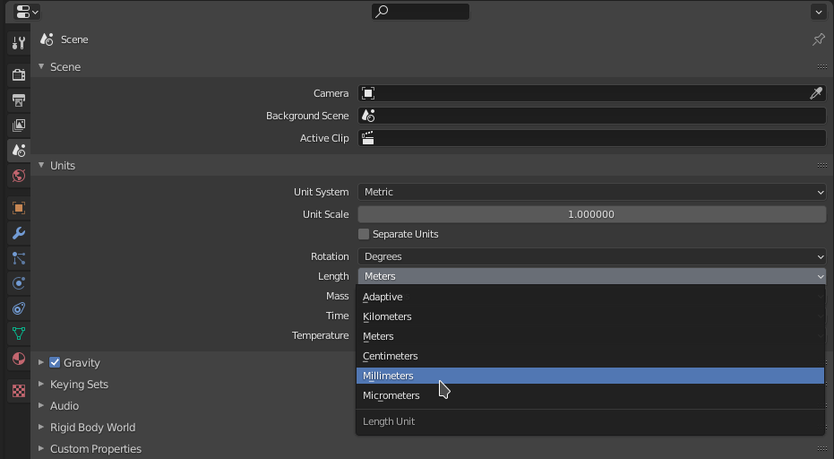
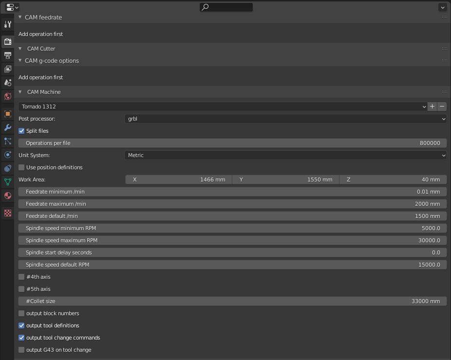
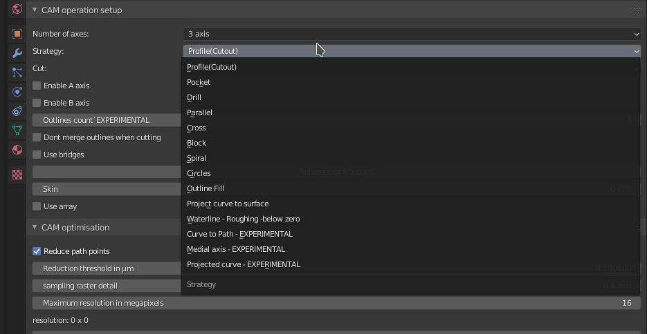
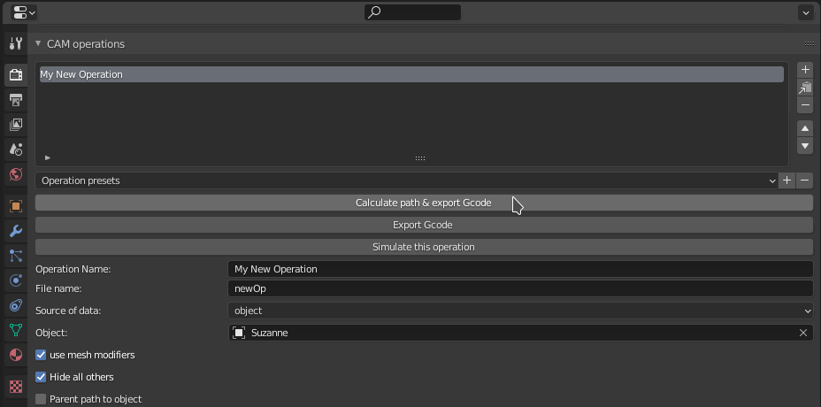
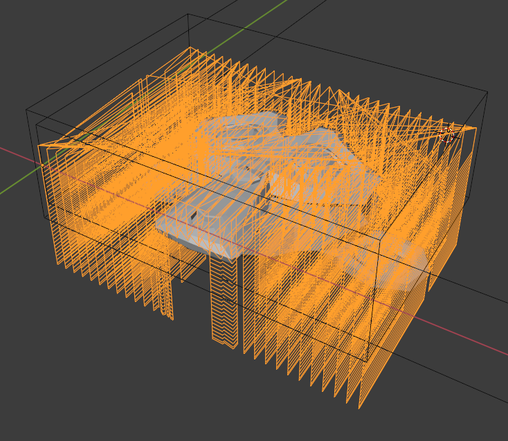
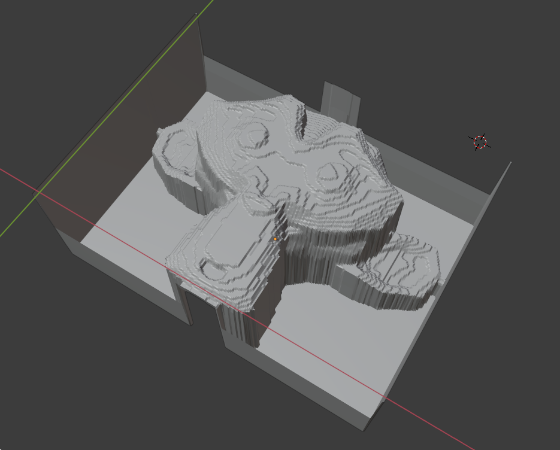

This is a step-by-step tutorial on generating a toolpath with Blender CAM. For detailed description of panel options go [here](Blendercam-Panel-Descriptions.md).

## Change render engine
First of all, change render engine to CAM to use the blender cam tool.

## Change units in Blender

Change units to metric or imperial in Scene properties.
:

## Setup machine parameters

Setup machine parameters (postprocessor, maximum feed rate, work area, etc.) in 'CAM Machine' options.

## Add a new operation

Add new operation in the render properties.

Choose Parallel (or Outline Fill, Circles, Spiral, Block, Cross) in the Strategy dialog. Waterline option works best when OpenCAMLib is installed and other operations require curve data source. See how to generate curves from mesh model [here](Profile%20and%20Pocket%20operations.md).

In Object dialog select object being source of geometry for toolpath generation.

## Configure Cam Material and position object

In CAM Material size and position, set radius around model option to reflect the amount of stock material to be machined.

Manually position object inside work area, or use "Position object" option to position it automatically.

If the box representing material doesn't update, uncheck "Estimate from model" option and then check it again.

## Configuration of the active Operation

Set "Distance between toolpaths" to desired value.

"Distance along toolpaths" option determines accuracy. Lower values result in more accurate toolpath, but make computation slower and increase amount of resulting G-code.

Select "Use exact mode" - it improves accuracy. If you have [OpenCAMLib](Opencamlib%20Installation.md) installed, also select "UseOpenCAMLib" - it impoves accuracy and speeds up the computing time. OpenCAMLib also enables high quality algorithm from calculating waterline toolpaths.

CAM Movement:

Enter layer depth (in Step Down dialog), operation depth, start depth and optionally end depth (if "Depth from object" is disabled).

CAM Feedrate:

Set feedrate and spindle rpm. "Plunge speed" and "Plunge angle" allows slowing down feedrate when the cutter is moving down on steep areas.

Cam Cutter:

Set cutter tool number (used in G-code), type, number of flutes and diameter.

## Multiples operations in a chain

To join multiple operations into a single G-code file, use CAM chains dialog.

## Calculate Path and Generate Gcode file

Click "Calculate Path" to generate toolpath. If "Auto export" option is selected, G-code file will also be created.

## Quick look of the final result

Next click "Simulate operation" to create model representing machined material.

